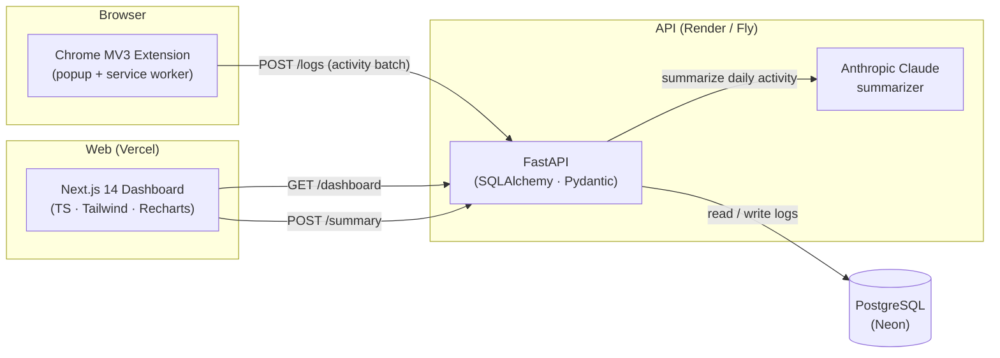

# FocusForge

> **AI-powered focus and productivity SaaS for developers and creators.**
> Block distracting sites with a Chrome extension, track focus sessions, and get Claude-generated insights into your productivity patterns — all in one dashboard.

<p align="left">
  
  
  
  
  
  
  
  
</p>

**🌐 Live demo:** _coming soon — see [Roadmap](#roadmap)_ &nbsp;·&nbsp; **🧩 Chrome extension:** _packaged release coming soon_ &nbsp;·&nbsp; **📚 API docs:** _coming soon_

---

## Screenshots

<p align="center">
  
</p>

<p align="center">
  
  &nbsp;
  
  &nbsp;
  
</p>

> 🚧 Screenshots are placeholders until they're captured — see [`docs/screenshots/README.md`](docs/screenshots/README.md) for the shot list.

---

## What it does

- 🧱 **Block distractions on demand.** A Chrome (Manifest v3) extension intercepts navigation to user-defined domains while a focus session is active.
- 📊 **Track focus time.** Activity logs are streamed from the extension to a FastAPI backend, persisted in Postgres, and aggregated into daily / weekly metrics.
- 🤖 **AI-powered insights.** Anthropic Claude generates a personalized daily summary of your focus patterns, top distractions, and momentum trends.
- ⚙️ **Per-user settings.** Manage your blocklist, blocking mode, and session defaults from a Next.js dashboard.

---

## Architecture



---

## Tech stack

| Layer | Stack |
| --- | --- |
| **Frontend** | Next.js 14 (App Router), TypeScript, Tailwind CSS, shadcn-style components, Recharts |
| **Backend** | FastAPI, Pydantic v2, SQLAlchemy 2.0, Uvicorn |
| **Database** | PostgreSQL 16 (Docker locally, Neon in prod) |
| **AI** | Anthropic Claude (Sonnet) for summary generation |
| **Extension** | Chrome Manifest v3, vanilla JS service worker, `declarativeNetRequest` |
| **Deploy** | Vercel (web) · Render or Fly.io (api) · Neon (db) |
| **CI** | GitHub Actions — lint, typecheck, tests |

---

## Repository layout

```
focusforge/
├── web/          # Next.js dashboard
├── api/          # FastAPI backend + Postgres docker-compose
├── extension/    # Chrome Manifest v3 extension
├── scripts/      # One-off scripts (icon generation, seed data, ...)
├── docs/         # Screenshots, diagrams, longer-form docs
├── LICENSE
├── README.md     # ← you are here
└── SETUP.md      # Full local setup walkthrough
```

---

## Quick start

> Full step-by-step instructions live in [`SETUP.md`](SETUP.md). The condensed version:

```bash
# 1. Start Postgres
cd api && docker compose up -d && cp .env.example .env

# 2. Run the API
python -m venv venv && source venv/bin/activate    # Windows: venv\Scripts\activate
pip install -r requirements.txt
uvicorn app.main:app --reload --port 8000

# 3. Run the web app (new terminal)
cd web && npm install && npm run dev

# 4. Load the extension at chrome://extensions → "Load unpacked" → select extension/
```

Visit http://localhost:3000 for the dashboard and http://localhost:8000/docs for the API.

---

## Roadmap

- [x] Working monorepo (web + api + extension)
- [x] Persistent activity logs in PostgreSQL
- [x] Weekly focus chart + daily metrics
- [x] MV3 extension with on-the-fly blocking
- [ ] Real Anthropic Claude integration for the daily summary
- [ ] Per-user authentication (Supabase / Clerk magic link)
- [ ] Settings page persisted to backend + synced to extension
- [ ] Live demo deployed (Vercel + Render + Neon)
- [ ] Pytest + Vitest coverage with GitHub Actions CI badge
- [ ] Packaged extension `.zip` published as a GitHub Release

---

## About

Built by **[Srinivas Thomala](mailto:srinivas.1796@gmail.com)** — a senior full-stack engineer focused on **AI-integrated SaaS products**. Available for freelance work via Upwork.

## License

[MIT](LICENSE) — do whatever you want with it.
